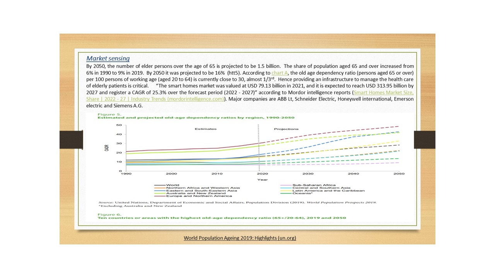
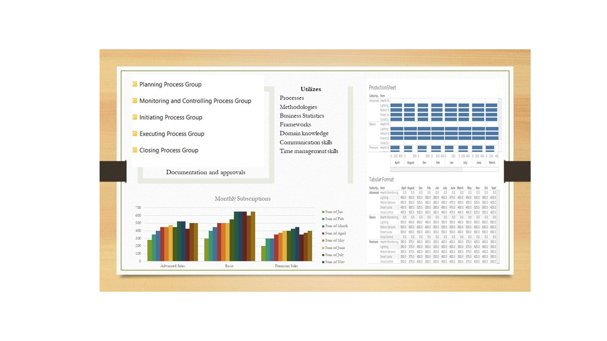
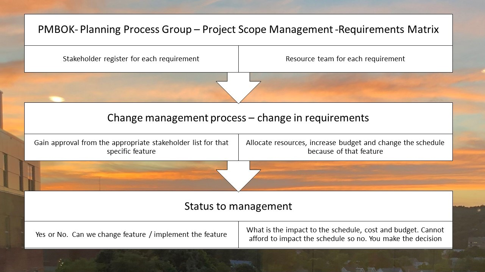
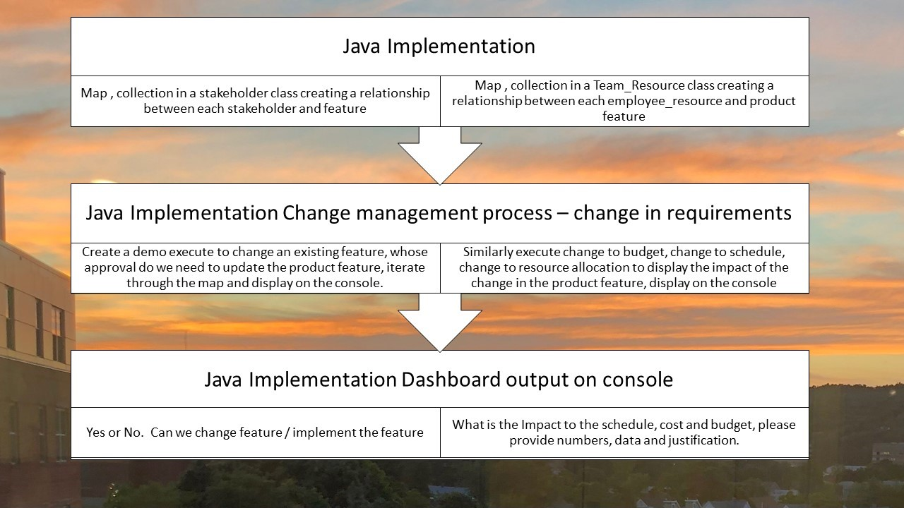
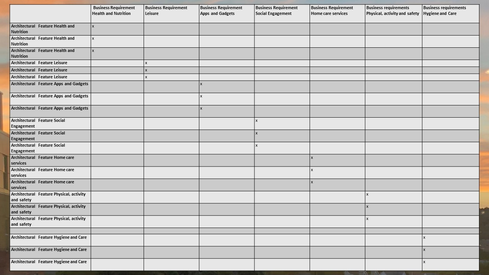
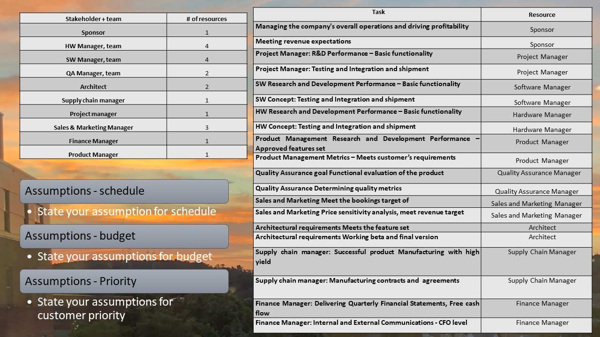

# Engineering Project Management

The project provides an introduction to program management cycle. Confidential information is not displayed. 

All images are either custom by Alpa D Desai or a reference name is included. Most of the images are custom.

## Smart homes for the elderly

## Smart homes for the elderly

## Smart homes for the elderly

### Program Manager Tasks

## Java project

## Java project resource allocation

## Java project 

Additional details reference https://github.com/alpaddesai/EngineeringProjectManagement
