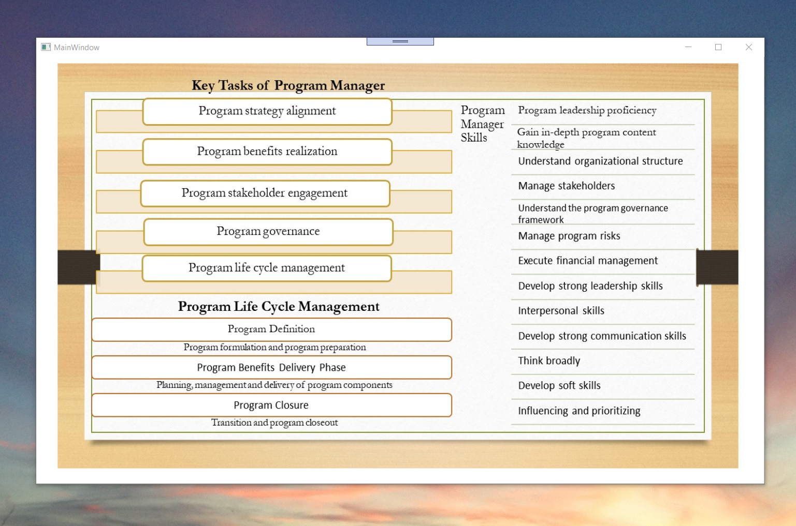

# Program Management

The project provides an introduction to program management cycle. Confidential information is not displayed. 

Please download the executable in https://github.com/alpaddesai/ProgramManagement/releases

All images are either custom by Alpa D Desai or a reference name is included. Most of the images are custom.

### Program Manager Tasks

### Certificate Associate in Project Management

## Financial Analysis

## Interest

Further reference : https://github.com/alpaddesai/NewProductDevelopmentProcessesv , https://github.com/alpaddesai/EconomicDecisionMaking ,   https://github.com/alpaddesai/SystemsEngineering , and https://github.com/alpaddesai/PowerandInfluentialSkills
