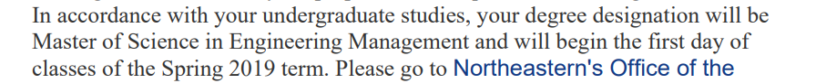

# Program Management

The project provides an introduction to program management cycle. Confidential information is not displayed. 

Please download the executable in https://github.com/alpaddesai/ProgramManagement/releases

All images are either custom by Alpa D Desai or a reference name is included. Most of the images are custom.

### Program Manager Tasks

## CAPM

## Graduate admission letter

## Application of blockchain technology

Further reference :  https://github.com/alpaddesai/SystemsEngineering , https://github.com/alpaddesai/UndergradTestScores_PowerandInfluentialSkills and  https://github.com/alpaddesai/EconomicDecisionMaking 
